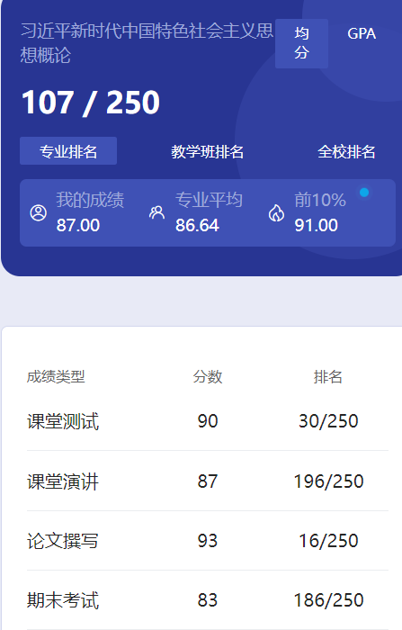

# 概述

​	老师是 wang jian。这个课似乎不是大一上的，不知道为什么我们提前上了。

# 测试

​	貌似是纸质的。

# 课堂演讲

​	记不清了。

# 论文

​	这个老师要求论文查重，并且不能高于30%。也是我大学第一次接触到查重这个东西，当时第二次改就21.9%了😋

# 期末

​	学习通考试，稍微刷点题就过了。这个课3学分，建议卷王们考前多花点时间刷题，性价比高的很，比那种3学分的专业课好拿分太多了。后面的近现代史、马原、毛概这些也差不多是这样，期末成绩一些佬甚至卷到95+，可真是不容易啊🤣

# 时间线

创建时间：2024.7.5

最后一次修改时间：2024.7.10
