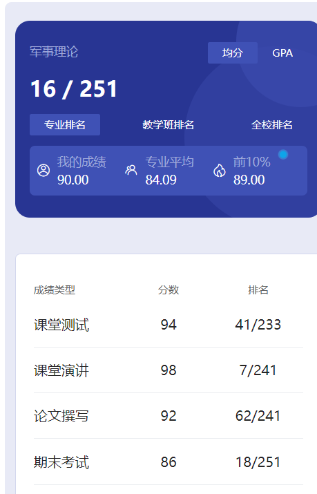

# 概述

​	老师是 sun ling。孙老师很好，我还选修了她的大学语文，都没有太大的课业压力，很轻松。如果有兴趣的话也可以认真听老师讲课，上选修课或者压力比较小的课程可以适当放松放松自己。

# 测试

​	好像是有雨课堂的测试题，貌似每个单元都有，这个有点久远，记不清了。

# 课堂演讲

​	小组合作，几个人一组，做一个PPT，需要一个人去演讲，当时我们小组的演讲人就是我😋

# 论文

​	有个论文，3000字手写，挺折磨的，非常痛苦😭但是我拖到了最后才写，当时也是有不少人还没抄，老师最后允许交电子版了。还好我就抄了一点点，赚大了！不过还是不推荐这样，当时应该是我们运气好老师允许了🤣

# 期末

​	开卷考试，这个期末题我觉得80%都可以在书上找到，最好熟悉熟悉课本，大致知道每章讲了什么东西，省的考试的时候太慌张。切记考试的时候一定要有书，不然大概率就寄了。然后有一小部分可能是新闻或者时政相关的题目，这部分的分数就不太好拿了。

​	如果目标只是通过的话，提前看看书，考试翻快点，考个七八十分问题还是不大的。但要是想拿高分，建议熟悉熟悉课本，还有老师上课记一些笔记什么的。

​	这个课没什么压力，还是很轻松的。

# 时间线

创建时间：2024.7.4

最后一次修改时间：2024.7.10