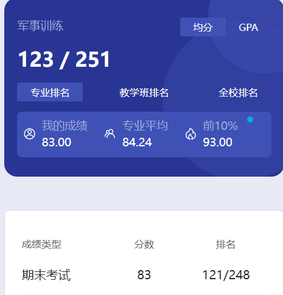

# 概述

​	这个其实就是军训了，大学生开学都是要经历的。

​	前几天基本上都是站军姿、喊口号、做一些基本动作、晒太阳什么的。最后会有一些表演，有警棍盾牌操，两军对决，摆字方阵，合唱，还有一些其他表演什么的。我当时就在摆字方阵里，其实就是“摆子”方阵。如果位置实在角落里，那真是啥事都没有🤣

​	这个军训成绩和你做什么其实没多大关系，“大概率”就是导员给的分数。在军训过程中，某天晚上导员会安排班委选举，一般来说班委的这个军训分数应该是最高一档，其他人的分数都没多大差别。

​	军训对我而言其实也没啥可说的，我也没多少印象了，就这样吧。

# 时间线

创建时间：2024.7.5

最后一次修改时间：2024.7.10
