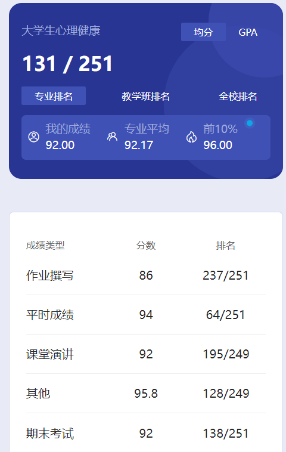

# 概述

​	老师是 xu jun。

# 平时成绩

​	每节课前有雨课堂扫码，应该是这个吧。

# 作业

​	这个我也记不清了，每节课倒是会时不时地随机抽人回答问题，不知道是不是这个。

# 课堂演讲

​	这个是小组合作一起做个视频，好像还有演讲，记不清了。当时我们班有一个视频我印象很深，是以一位同学为主人公（guan lao），描述了他从天天睡懒觉，熬夜打游戏，到最后自我改变努力学习的过程，这个视频还是很有意思的🤣

​	怎么说呢，虽然学校的课程大部分都很无聊，但有些东西如果自己用心搞得话，不论结果怎么样，我觉得还是能收获不少乐趣的😋

# 其他

​	这不知道是个啥东西。

# 期末

​	这个宣区是开卷，肥区是闭卷，不确定以后宣区会不会闭卷🤣期末考试必须有书，东西都是书上的，提前熟悉熟悉，考试翻快点，不会有什么问题，毕竟这个课总成绩平均分都有90+。

​	这个课难度不大，没什么压力，平均分都非常高，哪怕是卷王也拉不了你多少分🤣

# 时间线

创建时间：2024.7.4

最后一次修改时间：2024.7.10
