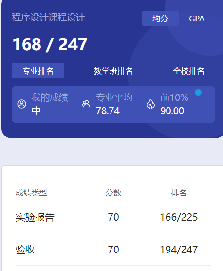

# 概述

​	老师好像是 zhou bo 吧，记不清了。这个不同班老师应该不一样。

# 课设

​	这个并不是上课，就是在最后几周做一个课程设计。我当时选了个很简单的，代码我就不放了，没啥技术含量。而且当时我们遇到了疫情，提前放假回家了，验收是开学来才搞的。验收时老师看了一下我的效果，就给了70过了。我这个实在是太简单了，没啥可问的，不到30s的验收🤣卷王们还是做个高分的课设吧。

# 时间线

创建时间：2024.7.5

最后一次修改时间：2024.7.10
