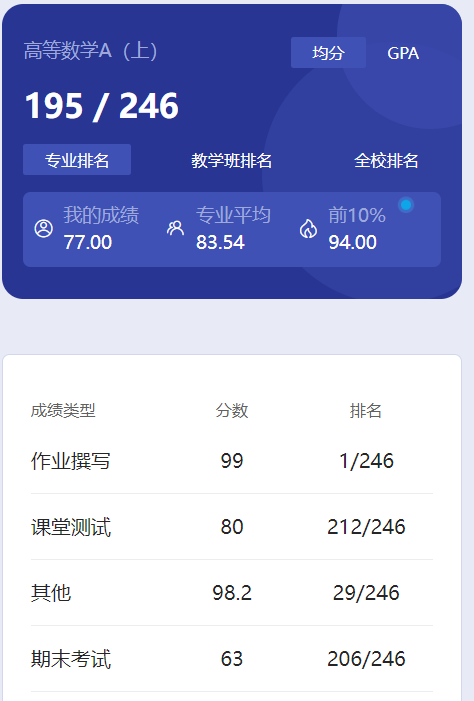

# 概述

​	老师是 chen guo qi。神中神，陈老师真的是非常非常优秀的老师，教学能力非常强，人也非常和善。老师很喜欢运动，那时我早上在操场上跑步，经常能见到他。他也很喜欢打羽毛球，不少同学都和他一起打过。我觉得陈老师的身体素质一定非常棒，不然怎么可能大冬天都穿着短袖呢🤣红色短袖最为经典了，到时候学弟学妹们肯定会非常吃惊的😋

# 作业

​	习题册。

# 测试

​	当时好像是有3次纸质测试，应该是取平均分，其他的老师有让用雨课堂做测试的。陈老师给保底70，作弊0分。所以，哪怕你什么都不会，在老师这都不用担心会拿很低的分数，尽力而为就好了。追求高分就得好好学了。

# 慕课

​	应该是成绩里的其他部分，这部分成绩我不是太清楚，按老师的要求做就行了。

# 期末

​	看到这60出头的期末我就知道老师一定是出手了，chen 老师太棒了😋

​	老师最后一节课会梳理重点，如果好好学了，一定要认真听，如果没学，那么我觉得你也听不懂🤣

​	谈到高数的期末想说的就很多了，当时QQ还是可以匿名发言的，楼群里的hxd们都在匿名发成绩，一个比一个高，我看着我60多的期末成绩瑟瑟发抖。直到那个男人的出现，压倒了所有人。没错，他就是渊！渊佬放出了他99的期末成绩，震慑了所有人，自此渊神便成了9号楼神一般的存在，渊神！！！渊神的故事也变成神话，一时间谣言飞起，四处传播，甚至有人说渊佬2天速成高数99，成为了神一般的存在🤣

​	这里我来辟个谣，根本不是这样的。渊佬几乎把书上的习题最少做了2遍。从开始到最后，学高数一直都很认真，高数书的侧面翻得都发黑。不得不感慨当时渊神学习的努力，要是能保持那个劲头，指不定渊神都保研了吧😍这里也可以看出速成的问题了，对于一些简单的课程，像线代、概率论这些东西，速成三四天不少人甚至都能考到90+的成绩。但对于高数、大物这些，想要考到90+，还是需要自己付出很多的，毕竟不可能有完美的捷径。

​	这里可以对比一下23级的高数上期末，貌似比我们的还简单一些。我认识的一个学弟高数总成绩满分，不得不感慨，真是太卷了，太强了。

​	高数6学分，大学阶段的课程中学分最高的课，没有之一。所以，无论想保研、转专业，还是想获得奖学金这些，高数绝对是重中之重。成绩是加权计算的，高数学分最高，可以理解为占比最大。所以，如果有以上这些追求的话，高数总成绩最好95+，卷王们慢慢卷去吧🤣别觉得95很高很难考，看看下面这照片，10%都94了，成绩出来的时候你就知道你的对手有多卷了🤣化用陈老师的经典名言，“我带过几千甚至一万！的学生，高数考90真的不难，简单题作对就可以了，考95甚至100需要把最后一题也写出来”，大致就这个意思，经典咏流传啊🤣如果没什么追求，只希望过了就行，那就像我一样喽😋

​	写这段文字的时候，看了看群里在实习当“牛马”的学长学姐们🤣看着他们的对话，感觉我现在可真是轻松啊。原来还想着毕业了就解脱了，现在虽然还没入职，我已经意识到了，在学校才是最轻松的时候。

​	学弟学妹们，珍惜在学校的时光吧🎗️

# 时间线

创建时间：2024.7.4

最后一次修改时间：2024.7.10
