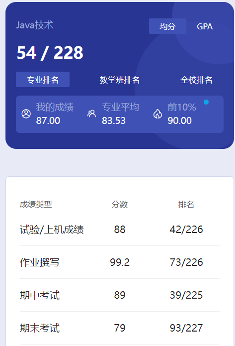

# 概述

​	老师是 lu qiang。路老师很好😋讲课很认真也很有意思，上课也会经常分享一些别的知识。我记得当时ChatGPT出来的时候老师还让我们多学习学习，提醒我们要注意技术与职业的发展，我觉得应该没多少老师会跟学生说这些。

# 作业

​	一共五次作业，老师即便改题，偏差应该也不会太大。“正常”写分数就不低，路老师给分很高，看下面的图片就知道了。题目也不难，认真写也花不了多少时间。

# 期中

​	老师当时让我们开卷，大部分都是简单知识，不少概念题。我当时虽然没怎么学，都感觉挺简单的。

# 实验

​	四次实验，部分专业可能不用搞实验四，不过计算机专业肯定是躲不掉的🤣前三个还好，第四个稍微有点折磨😡得学点Javaweb的知识，还要会配置Tomcat，里面貌似还有jsp就逆天。验收的时候注意不要太早验收，观察观察哪个学长比较好说话。当时我们验收的时候有个学长很好，有一个很严格，最后大家都到那位比较轻松的学长哪里去验收了。

# 期末

​	我感觉不是很难。编程题注意一定要执行一下，机器会改一次，老师也会改，所以不用担心编译错误跑不起来程序。程序意思对了，老师应该就会给大部分的分数。当时期末那个IDE是JCreater，这玩意是真垃圾，快把人搞疯了。没有代码提示，API都得自己记，报错了半天都看不出来问题在哪，气死人了😡不过也可能是当时太菜了，不像现在项目都写好几个了😋现在来看过去是真菜啊，啥都不会🤣

​	相比C++，Java课的难度还是小很多的。

# 时间线

创建时间：2024.7.11

最后一次修改时间：2024.7.13
