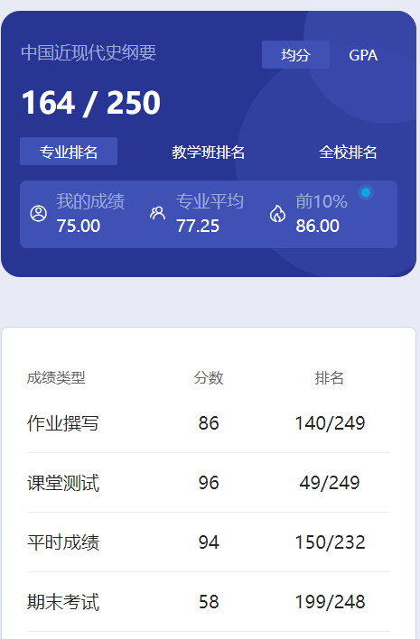

# 概述

​	老师是 li qing yu 和 wang tian yun。

# 作业

​	记不清了，应该也是学习通。

# 测试

​	学习通课堂测试。

# 平时成绩

​	这个有扫码，当时好像还有变动的二维码，每隔几秒就刷新，有时甚至有地理距离限制。扫码不在一定范围之内也判定失败😡我在这提醒一下，马院的课千万别让老师抓到你迟到或者漏交作业。出现了大概率就是挂科，什么成分懂得都懂吧😡

# 期末

​	这期末有简答题，恶心死了。当时期末没到60，还以为要挂科了，吓我一跳。这个我也不确定刷题有没有用，我当时是没刷。看这前10%连90分都不到，也能看出有点难度了。

# 时间线

创建时间：2024.7.22

最后一次修改时间：2024.7.22
