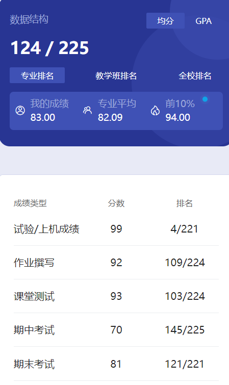

# 概述

​	老师是 zhang xian yi。老师挺好的，讲的还可以，认真听还是能听懂的。这么说是因为有的老师讲课确实听不懂🤣

# 作业

​	10次作业，我给出来了。

# 测试

​	雨课堂测试，有很多题，不过答案好像就在PPT上面。

# 期中

​	我们当时考到了树的章节，不是太难吧。

# 实验

​	这应该是大学阶段最多的任务之一了，一共9个报告。不过老师只要交前八个，排序实验选做，除了排序实验我都给出来了。这一个实验就算是大佬平均也得1个小时吧，后面的树和图的实验很恶心，这些实验和作业对应的报告和代码学长我都给出来了。这应该能帮学弟学妹们节省不少时间，加上我给出的其他课程资料，如果学长的资料有帮助到你，可否给学长点赞助呢😋如果完全自己写的话，那估计会花不少时间。

​	前三个实验我放在了一个文件夹里，后面几个树和图的实验我在文件夹里给出了对应PPT和文件，不要改那些文件。记事本之类的工具打开自己看一下就明白了，那些文件是和PPT里的树和图的图片对应的，改了就对不上了。这些代码我后来都没改过，应该是没什么问题的。实验验收只要能讲明白原理就行了，每个实验都有评分，最后应该是取平均值。到时候有老师和助教验收，我是在助教那里验收的，问的问题基本上都答上来了，给的分都是99或者100。我觉得就算没答上来，只要验收了，报告写了，“可能”都有90，这方面老师很仁慈的😋我不是太确定，最好还是学点吧，要是你真的啥也不知道那验收未免也太尴尬了吧🤣

​	代码怎么跑，学一些对应的知识，看一看应该就明白了。有一小部分代码可能有问题，你不说老师或者助教应该也看不出来，验收时混过去就行了。如果你发现不了，那对你大概率也没啥影响🤣

# 期末

​	好好复习就行了，应该不至于挂科。数据结构不管是你准备读研还是工作都非常重要。考研408，工作如果是大厂都有算法题的。这个课还是非常非常重要的，建议好好学，为将来打好基础。

​	当时开学买了工大小题的册子，除了这个好像也没别的参考资料了，凑活用吧。我给出的那张试卷应该就是工大小题的。

# 时间线

创建时间：2024.7.19

最后一次修改时间：2024.7.22
