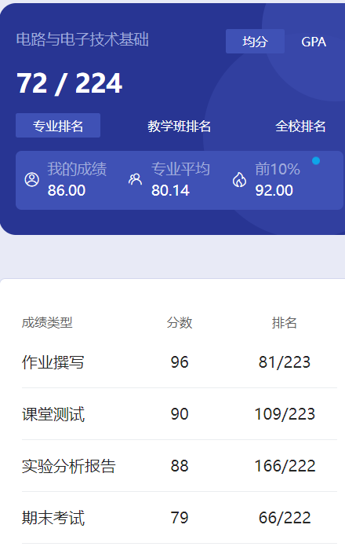

# 概述

​	老师是 yin wen fei 和 chen xin。这个课就是基本的电路和模电，两个课各占50%。我那时这个课3学分，不过23级好像已经是4学分了，还好我们上的早🤣听学弟说比我们那时还难了不少。

# 作业

​	课后作业吧。

# 测试

​	电路和模电都是纸质课堂测试。当时模电测试临近下课10分钟我才到教室，然后也写完了，懂得都懂吧🤣还好老师没有为难我😋模电老师没有提前说测试时间，差点就翻车了🤣

# 实验

​	这个电路和模电都有实验。本来想把自己的资料传上来， 结果发现是PDF，而且都有自己的名字什么的，想来想去那就不发了，学弟学妹们自己努力吧😋

# 期末

​	当时速成的，我们那年期末很简单，接近基本概念那种，很轻松就能过。不过23的学弟说他们难了很多，再加上多了1学分，还是小心点吧。我给出的卷子我觉得参考价值不大，可能不是计科的卷子，看好课程代码。

# 时间线

创建时间：2024.7.14

最后一次修改时间：2024.7.19
