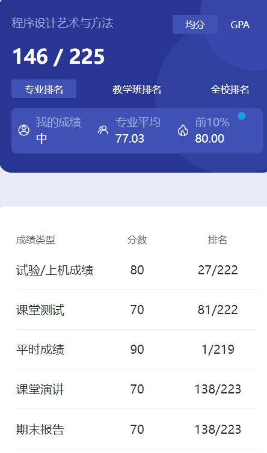

# 概述

​	老师是 xu ben zhu。这个课很难绷😡算是教一些算法相关的东西。上课基本上就是在讲题目和一些思维，老师的经典话语“这个问题很难吗？”，上课你就懂什么意思了😡

# 实验

​	就是个人的作业吧，每个人搞几个题。

# 测试

​	当时我们是上课时纸质写的。

# 平时成绩

​	不清楚。老师上课会提问，如果不在的话，估计会扣分。会根据回答情况评级，分数应该就是参考这个。

# 演讲

​	小组合作。几个人一组，合作搞那个什么比赛的题目，还得PPT演讲讲解，无语死了😡每年应该都是新的，所以我就没给资料了。

# 期末

​	不清楚。我记得当时的主要任务就是作业和小组合作了。这个课是真烦人，没啥可说的😡

# 时间线

创建时间：2024.7.13

最后一次修改时间：2024.7.14
