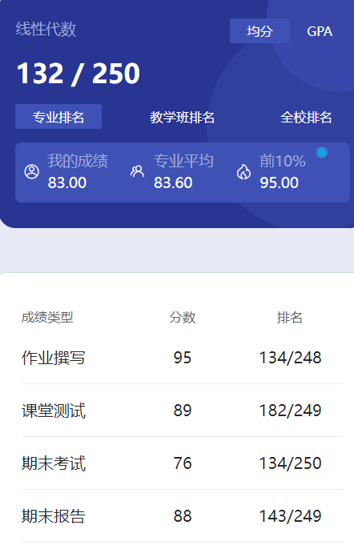

# 概述

​	老师是 li jie 。很轻松，讲着讲着还会问我们听懂了没有，没人回答就笑笑继续讲了🤣

# 作业

​	习题册。

# 测试

​	我们当时是雨课堂吧。

# 报告

​	写报告，不是很难，但是想高分不容易。

# 期末

​	我给的卷子里有的好像不是宣区的，注意一下。最好自己找点近几年的卷子。

​	看看往年卷子就明白了，题型都是死的，速成个三四天考个八九十都不是问题🤣没啥可说的。

# 时间线

创建时间：2024.7.22

最后一次修改时间：2024.7.22
