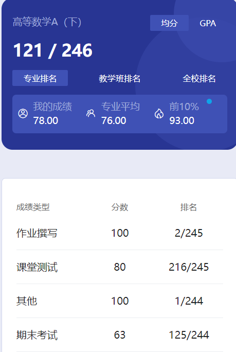

# 概述

​	老师是 chen de zhu。老师人很好，很和善。点名的时候老师还提醒我们记得来上课呢😋

# 作业

​	习题册。习题册每年应该都会有一点点题目变化，老师上课还说有的人抄的题都对不上🤣

# 测试

​	雨课堂。

# 其他

​	慕课吧，按照老师的要求做就行了。

# 期末

​	高数下比上难度大了很多，从挂科率也能看出来，复习的时候还是认真一些。陈老师给分很高😋

​	那个23-24的卷子是我在大群里看见的，不确定是不是真的。

# 时间线

创建时间：2024.7.19

最后一次修改时间：2024.7.20
