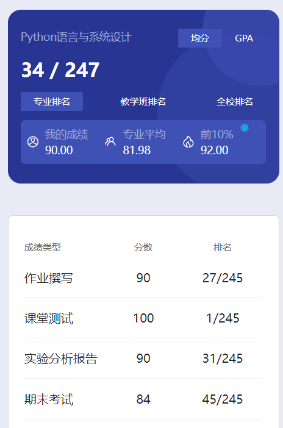

# 概述

​	老师是 ma xue sen。马老师讲课口音还是比较重的，有时候甚至讲了半天都不知道他在说什么🤣不过老师讲课还是挺有意思的，也会经常讲故事。给人的感觉就是年轻，有活力。

# 课堂测试

​	雨课堂测试。老师还提前发了一遍让大家做了一次，后来又测试了一次，最后基本上都是满分😋

# 实验

​	3次实验。其实和作业差不多，当时也没有验收。

# 大作业

​	这个大作业应该就是成绩构成中的作业。我给出的其实就是我数据结构当时的课设，没办法，混子就是这样了🤣

# 期末

​	今天是我大三的第一天。刚巧有学弟问我要Python期末的卷子，顺便就写了这个文档。我给出的那几个卷子参考意义不是很大，记得听老师说的重点。我们当时最后一个大题考了他PPT里的东西，用于解析txt格式的防火墙日志。就在第七章那个课程思政的PPT里。

​	考试不是很难，还是比较难挂科的。

# 时间线

创建时间：2024.9.9

最后一次修改时间：2024.9.9
