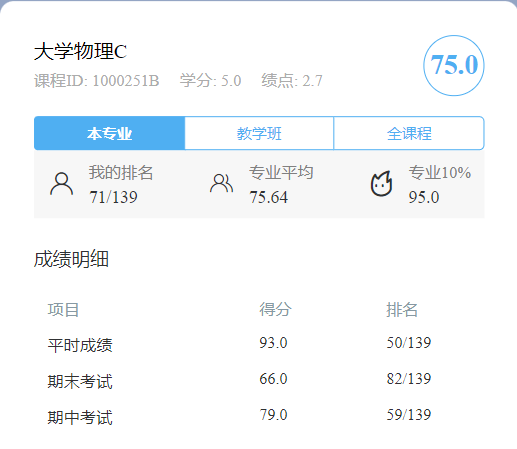
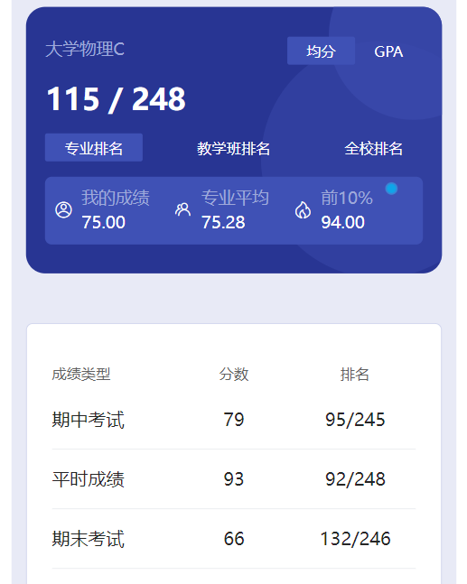

# 概述

​	老师是 pan gang。神中神！我个人觉得他和 chen guo qi 是我大学里目前遇到的最好的老师，不管是为人还是教学上都非常非常好。他们都很像高中的老师，讲课备课都非常认真，我认为这在大学的老师里是相当难得的🤣

# 作业

​	课后题。

# 期中

​	当时考了前三章，东西不是很多，也不是很难。

# 期末

​	我找成绩的时候space课表小程序挂了，用的hfut+小程序截图的成绩。这两个小程序统计成绩人数不太一样。

​	机械专业可能上下两本大物书都要学，我们当时是只学上半本书。大物期中+期末占比有70%，除了考试只有30%的成绩老师比较好捞，挂科率还是很高的。大物难度也不算小，想要速成也不容易，哪怕目标只是通过也要认真复习。而且这个5学分，也是相当高的学分了，保研的话更得好好搞。

​	文档里每每谈到保研，都是好好搞、好好卷、考高点，感觉保研的佬们真不容易啊，什么都得搞，什么成绩都要卷🤣

​	今天周六，熬过了这周三生不如死的计算机体系结构期末，稍微能喘口气了。好久没写东西了，今天没什么事，更新一篇，也略微修改了一部分以前的文档😋

​	下午的时候学长把space修好了，想了想plus的这个照片就不删了，两张都放着吧。

# 时间线

创建时间：2024.11.30

最后一次修改时间：2024.11.30
