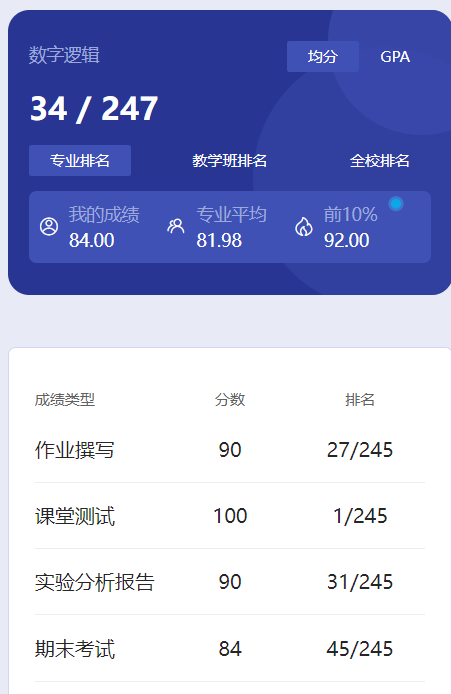

# 概述

​	老师是 ding xian qing，神中神。丁老师人非常好，非常非常给力😋

# 作业

​	都是书上的题目，答案也都给出了。

# 测试

​	上课纸质测试，我当时啥都不会，自求多福吧。

# 实验

​	这个就有的说了，大部分人实验的时候都是啥也不会，纯粹傻站着耗时间，比如我🤣如果你实在不会，拖到了最后，老师让你先签字再做实验，耗到最后就走了，即“熬鹰”🤣

​	有的人甚至趁老师不注意，把人家已经验收好的同学的箱子搬到自己那里。我觉得老师肯定是看见了，就是懒得说罢了。可能老师这么多年也是见多了，看破不说破🤣

# 期末

​	我觉得还是挺简单的，题型都差不多，而且出的题难度不是很大。总之，相信牢丁😋

# 时间线

创建时间：2024.9.9

最后一次修改时间：2024.12.17
