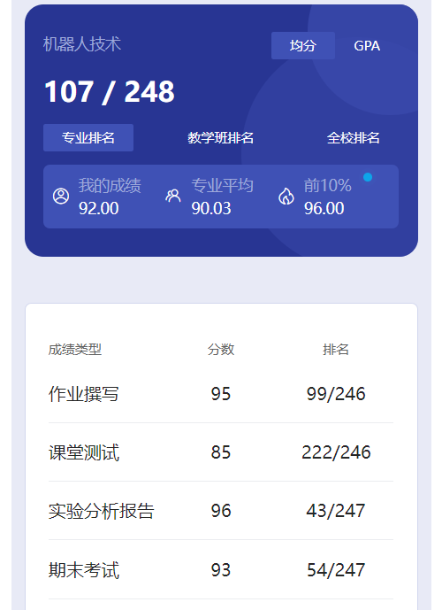

# 概述

​	老师是 li jun zhao。

# 作业

​	前三个给出了，第四个我是纸质写的，上面有我的名字，所以就删了，学弟学妹们自己搞吧😋

# 测试

​	忘了。

# 实验

​	主要就是实验七，其他也没啥说的，大家的代码基本上都是祖传的🤣

# 期末

​	看着成绩也懂什么成分了吧。考试开卷，把那个实验56题打印下来，然后带上书，就没什么问题了。

# 时间线

创建时间：2024.10.2

最后一次修改时间：2024.12.17
