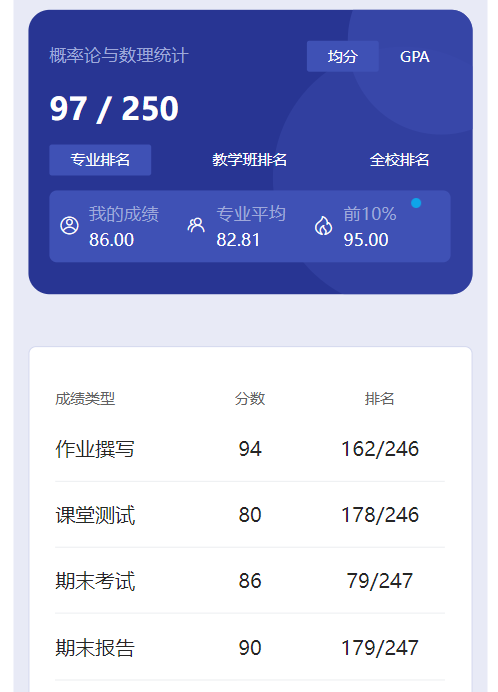

# 概述

​	老师是 jiang hui。不得不说 jiang 老师上课说话声音是真大，隔着几个教室都能听见🤣概率论这东西比较贴近生活，上课会讲不少有意思的东西。老师会搞一些莫名其妙的签到，动态二维码，地理位置限制扫码、学习通抢答等等，不得不说玩儿的是花啊🤣

​	但是看下面的成绩构成，也没有找到出勤的成绩，估计就是吓唬人的。你可以赌她的枪里有没有子弹🤣

# 作业

​	习题册。

# 测试

​	学习通测试。

# 报告

​	给一定的选题范围，写个报告。

# 期末

​	她会发不少往年的考试卷子，这个倒是挺少见的。由于“某些历史原因“，绝大部分老师都不给往年试卷，难得她能给那么多。

​	这个课速成突击很容易。当时我把近几年的题都刷完了，写了就知道和线性代数差不多，题型都是死的，复习了两三天考了80多。当时以为自己保底都90+，没想到才80多。这可不是凡尔赛，有些课突击是真简单🤣

# 时间线

创建时间：2024.11.30

最后一次修改时间：2024.11.30
