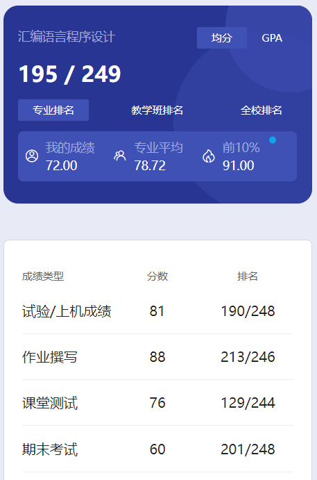

# 概述

​	老师是 zhang ben hong。神中神😋张老师人非常好，很和善，上课也挺有意思的。

# 作业

​	学习通上面布置了几道题。

# 测试

​	学习通，上课测试。

# 实验

​	追求高分的话需要验收，不验收的话有保底80，不少了。如果保底，理论上在机房待着，签到完就可以走了😋

​	怎么说呢，还是建议稍微学点东西，至少会用那个Dos的虚拟环境执行程序。B站上看个视频学一下就好了，花不了多少时间。以我对老师的了解，他每年应该都会改作业和实验的题目，不是简单变数据那种，有些题目会有逻辑上的变化。要是你啥都不会，那估计只能别人给你搞，或者抄别人的了。

# 期末

​	今天挺累的，晚上回宿舍不知道干啥了，就想着再写一门课吧。

​	注意，那复习资料并不是老师给的，应该是以前的某位学长学姐写的，来源我也不清楚，感觉写的挺好的。19-20那个卷子太老了，参考价值有限，21-22那个可能还有点用。不过我觉得也就那样，上面我也说了，老师比较喜欢变题目，不光是作业、实验什么的，考试也是会相对于之前有部分题目变化。他教的别的课也是这样，不像线代、概率论这种科目，考试题目类型完全是死的。那两个卷子看一看，知道大致会怎么出题就行了。

​	这个科目我觉得不是很难，虽然我没学，印象中不少人都90多。麦克阿瑟曾经说过，当我看到期末60，我就知道那个男人出手了。如果期末是45，总分是60，那就更好了。如果让我和 zhang 老师的学生比赛学习，那么我宁愿对手是上帝。因为 zhang 老师的学生只要写满了就不会挂科😋

​	稍微学点东西，大题多写点应该就不会挂科。保研佬追求高分仍需努力🤣

# 时间线

创建时间：2024.9.13

最后一次修改时间：2024.12.17
