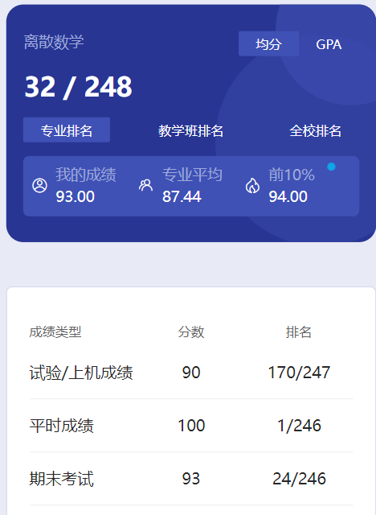

# 概述

​	老师是 yin jian hong，褒贬不一。我觉得 yin 老师是神一般的存在，懂得都懂😋各种花活，点名一下子点一个寝室，还让人上台自我介绍，经常督促我们进行体育运动🤣不过她可能快退休了，不知道还有多少学弟学妹们能受到她的庇佑呢🤣

# 平时成绩

​	不清楚。中间进行了一次课堂测试，不知道是不是这个。

# 实验

​	很轻松

# 期末

​	最后一节课一定要去⚠️考前多问问同学老师平时有没有划“重点”，问往年的学长当时考试是怎么回事。最好问一下，以防有变⚠️懂得都懂吧，我也只能说这么多了🎗️

# 时间线

创建时间：2024.10.2

最后一次修改时间：2024.12.17
