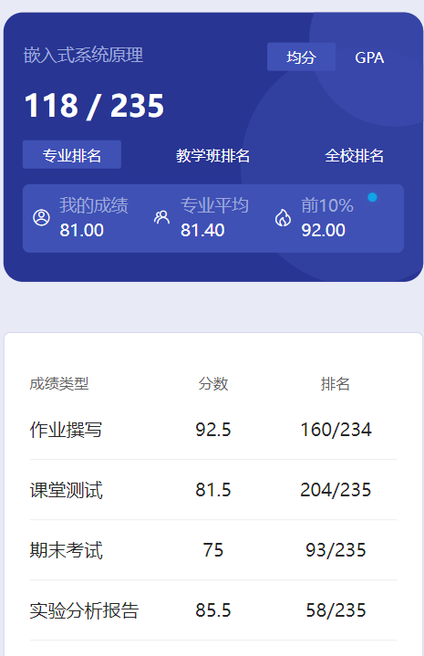

# 概要

​	老师是 zhang ben hong 和 lv zeng wei。两位老师都挺好的，上课也很轻松，没有太大压力。

# 作业

​	学习通布置了几个题。

# 测试

​	学习通布置了几个题。

# 实验

​	这个实验是真折磨。根据学号两人一组，一共做了两次还是三次我也记不清了。总之跟着指导书做，我是混过去了，什么都不知道，有时候指导书都看不明白，也可能跟之前没学过嵌入式相关的知识有关系。每次都要验收，验收的时候大部分人都是什么都不知道，全程“装死”🤣这种的最后老师就会给个及格分过了。

​	最后有个实验是搞个程序在那个开发板上，输入学号和日期，运行成功之后拍照保留一下就行了。这个理论上来说只要有一个大佬完成了，用他的板子执行就行了。这个实验不需要验收，但是要注意拍照片，不然报告没法写。

​	由于照片里有我的学号姓名我也懒得去弄，就直接删除了，小登们自己搞吧🤣

# 期末

​	结合参考资料1、2还有PPT复习就没什么问题了。资料1应该是一个大佬学长或者学姐的，资料二是当时我们楼群里的一个大佬总结的，期末要背的东西很多。zhang 老师神中神，海底捞，多写，写了就有分。认真复习，然后选择相信 zhang 老师就行了😋

# 时间线

创建时间：2024.7.1

最后一次修改时间：2024.12.17
