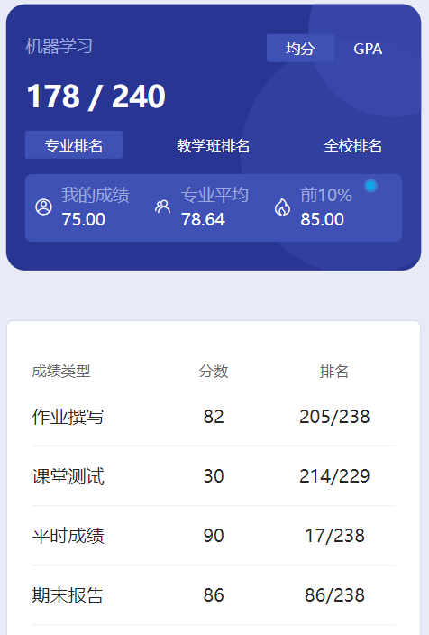

# 概述

​	老师是 liu jian。

# 作业

​	每年题目应该都不一样

# 测试

​	雨课堂，难度很大。如果想拿高分，感觉只能好好听课🤔

# 平时成绩

​	老师会点名

# 期末报告

​	这个没有期末考试。最后有小组作业，每个组选个题，每个人也有对应的任务。深度学习相关的东西，不过难度不是很大，就是有点麻烦。

# 时间线

创建时间：2024.12.17

最后一次修改时间：2024.12.17
