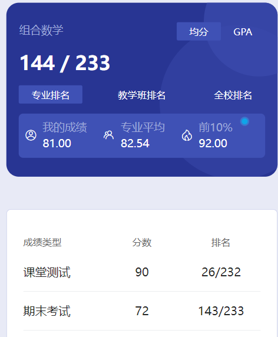

# 概述

​	老师是 yin jian hong。yin老师算是我遇到的最有“个性”的老师了，这时的她偶尔还会点名什么的，不过比上学期次数少多了。

# 测试

​	有个课堂测试。

# 期末

​	参考两个猜想文件以及我的考后记录，还有老师平时”可能“划的范围。注意，yin 老师出题有各种可能性，尽量问一下往届学长考试情况，对比对比，还要问班里的同学老师平时有没有说什么，以防万一🎗️

# 时间线

创建时间：2024.7.1

最后一次修改时间：2024.12.17
