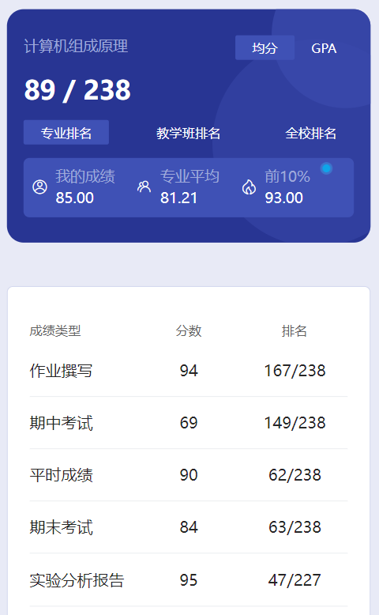

# 概述

​	老师是 yang yi 和 jia wei。jia 老师神中神😋

# 作业

​	课后题

# 期中

​	都是课后题，挺简单的，当时几乎没学都考了60多🤣

# 平时成绩

​	jia 老师课前有提问，这个可能是平时成绩

# 实验

​	这实验报告里边有很多我的学号，我就没放资料里了。我已经分享了这么多了，剩下的就自己写吧。印象中这实验也挺多的，一共有8个，4个实验在机房搞。

# 期末

​	当时我没有收到往年卷子，但是 jia 老师最后一节课划“重点”了。我愿称之为除 yin 老师外的最强者，背了几天考了80多😋如果任课老师是 jia 老师，最后一节课一定要去。

​	其实写文档的过程中，好多次我都想放弃，删库跑路了。整理这些资料以及写文档费时费力，而且做这个事情没有任何回报。虽然我也把收款码放那里了，可是目前为止1分钱都没收到过。这里的实验或者卷子放到大群里大部分卖个5R都不是问题，像数据结构那种任务特别多的贵一点也有人收。但最后我还是决定善始善终，抽时间也要完成这个任务🎗️

# 时间线

创建时间：2024.7.1

最后一次修改时间：2024.12.17
