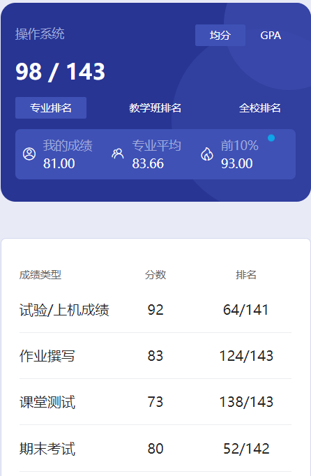

# 概述

​	老师是 tian wei dong。

# 作业

​	每章会布置课后题。操作系统相关的任务必须得在学校用校园网，登录老师们做的一个网站交。用学校的webvpn都不行，只能用校园网😡

# 课堂

​	可能是测试成绩。好几次上课随堂测试，老师有可能搞突然袭击。最后有一个比较正式的测试。

# 实验

​	好几次上机实验，也是得用机房的网络，必须在机房里搞，稍微费点时间。

# 期末

​	我们当时期末考试大题是生产者消费者和银行家算法。到了大三下都没啥人看成绩了，小程序只会显示看了的人的数据。目前两百多人就143人看了成绩，大家都成老油条了，成绩都懒得看了🤣

​	那个期末复习资料是我一个保研的朋友从老师的PPT里总结的。

# 时间线

创建时间：2024.12.17

最后一次修改时间：2025.3.6
