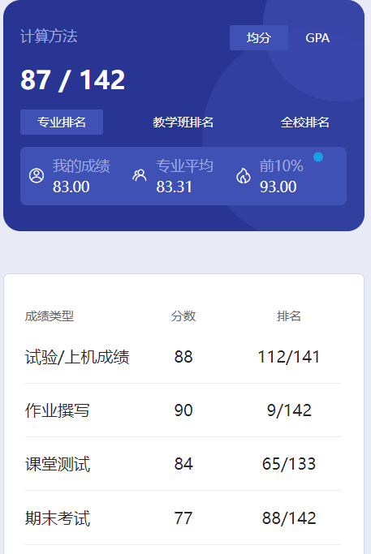

# 概述

​	老师是 zhu xiao ling。

# 作业

​	课后题

# 测试

​	我们当时是雨课堂

# 实验

​	上机

# 期末

​	老师似乎是临时上这个课，上课PPT也比较精简，当时考试也没有可参考的期末卷子，不确定以后还是不是她教。但听他们说考的很多都是课后题类型的，我是突击了3天，加上考试开卷，也没太大问题。

# 时间线

创建时间：2024.12.12

最后一次修改时间：2025.3.6
