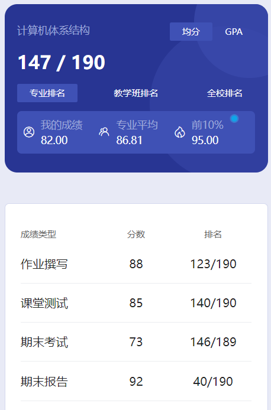

# 概述

​	老师是 ding xian qing。神😋

# 作业

​	好几次纸质作业。

# 测试

​	纸质测试

# 期末报告

​	应该是2个课后大作业，分别是3选1和2选1写报告

# 期末

​	以前老师是li jian hua，到我们这改成 ding 老师了。2个老师出的题型不一样，所以当时考试没有卷子参考。东西真是太多了😭多的根本看不过来😭那个复习参考资料是我的一个保研大佬朋友从老师的PPT里总结的，总结后东西还有那么多，这个课东西实在是太多了，能过纯靠 ding 老师出手，神中神，天神下凡，给老师磕一个😍😍😍

# 时间线

创建时间：2024.11.30

最后一次修改时间：2025.3.6
