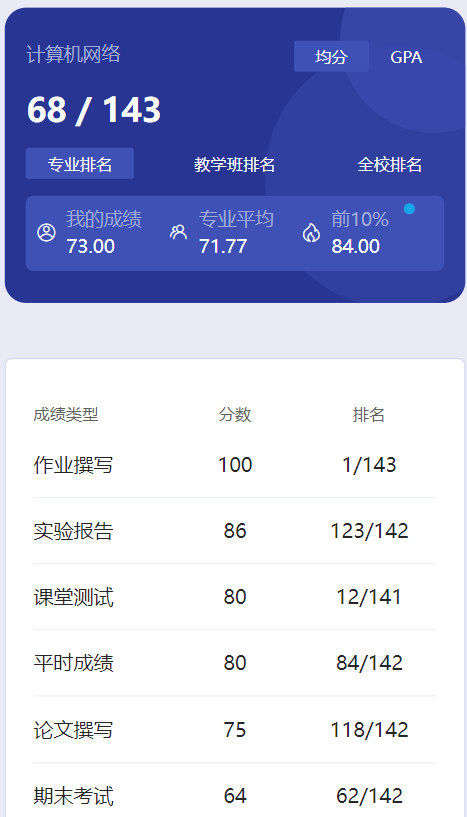

# 概述

​	老师是 zhou jian。

# 作业

​	在每章PPT的最后。老师要求作业都要加上自己学号的水印👎

# 测试

​	只进行了一次纸质测试，都是一些开放性的题目。

# 实验

​	机房上机

# 论文撰写

​	在PPT最后，我们当时写了2章的报告

# 期末

​	宣区和合肥老师不一样，卷子也不一样，当时收了很多卷子，都没啥用，不用去花钱找，都是假的。

​	在期末那个文件夹里面，我记录了我们那年期末的题型以及部分题目。里面还有前几年学长的回忆和20级的卷子，那些才是真的卷子，都是考后记录的，这部分资料是我一个保研大佬同学给的😋那个24-25题目预测是我另一个保研大佬同学从那个回忆版资料里总结加上他自己预测的。仓库里有的科目有一些总结过的复习资料，都是他考前总结完发我的，很有助于期末突击复习😋在这给他点个赞👍

​	希望有学弟学妹能将计网这部分资料传承下去🎗️

# 时间线

创建时间：2025.1.6

最后一次修改时间：2025.3.6
