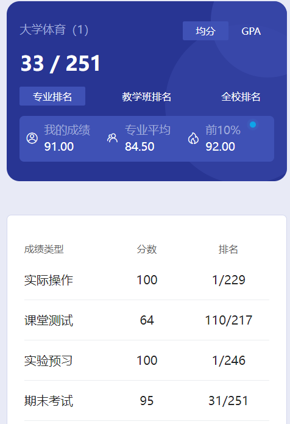
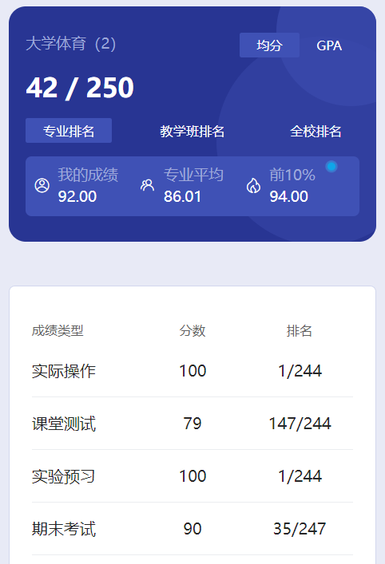

# 概述

​	老师是 zheng guo xiang。郑老师人很好，排球课也挺有意思的，就是稍微累了点，夏天一直晒太阳。体育课是自己选的，也是必须选的。每次选课是一学年的，不是一学期的，而且只有大一和大二有体育课。

# 实际操作

​	这个我还真不知道是啥东西。

# 测试

​	也不清楚是啥。这个测试和实际操作可能是云运动以及体测的成绩。

# 实验预习

​	这个应该是老师在雨课堂上发的PPT，按要求看完就是满分了。

# 期末

​	大一上期末是两个人相互打球，一共40个来回是满分，24个是及格。这个当时有两个大佬协助我们，很多人都是40个满分，我也是😋有好几次机会，平时认真训练其实这个考核挺轻松的。而且排球课摸鱼时间还是比较少的，认真训练就好。实在太菜的话，找个大佬和你对打，也是没什么问题的😋

​	大一下期末考核是发球，过线3个就及格，10个满分，我当时发了9个😋认真练习，没什么压力。

​	总的来说排球这门课即使是零基础，只要平时认真练习，通过也是很轻松的。我就是零基础，最后分数也很高。而且老师要求也很宽松，体侧的时候，郑老师也会“暗中相助”的😍如果体育也想考高分，可以考虑考虑郑老师的排球。有的保研佬真的什么都想卷，哪怕体育就0.5学分🤣

# 时间线

创建时间：2024.7.5

最后一次修改时间：2024.7.5
