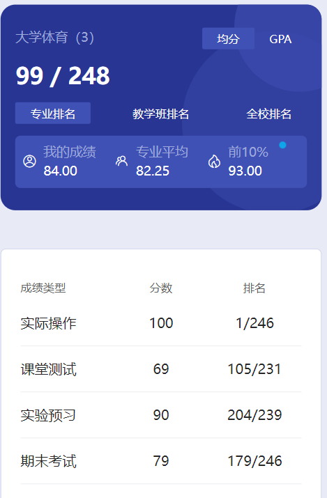
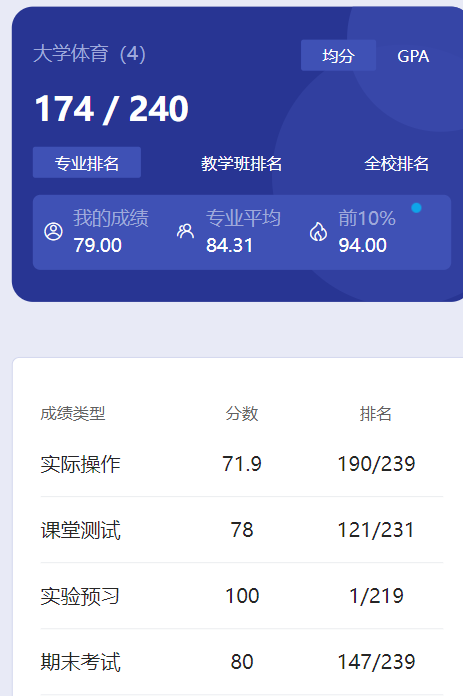

# 概述

​	老师是 qi hong。

# 实际操作

​	不清楚，可能是看PPT，不然应该不会满分。

# 测试

​	可能是体测成绩。

# 实验预习

​	不清楚。

# 期末

​	这个课的好处是夏天不用晒太阳，在操场下面的房子里练瑜伽，冬天就比较冷了。考核也不是很难，但我觉得高分不太好拿。毕竟这课评分标准主观意愿比较重，主要就是看你动作做的是否标准。保研佬追求高分不建议选🤣

# 时间线

创建时间：2024.12.17

最后一次修改时间：2024.12.17
