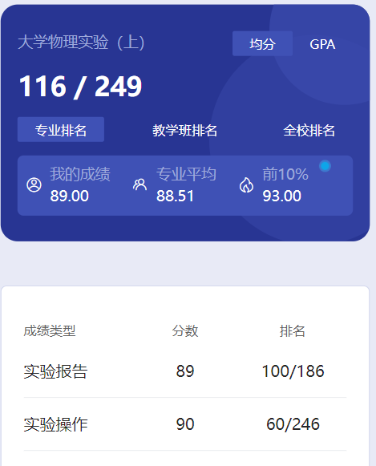
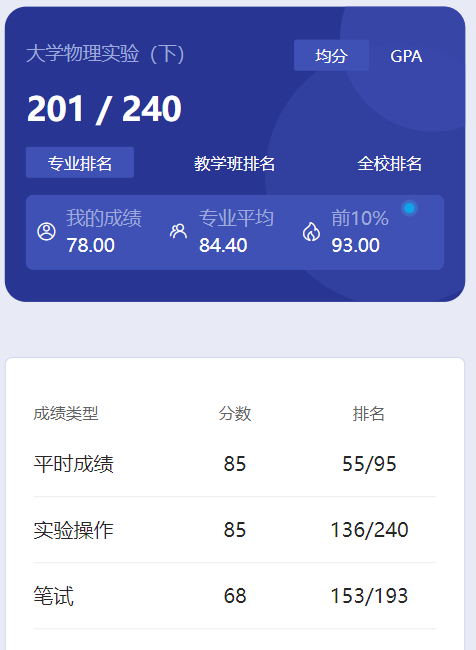

# 概述

​	老师是 pan gang 和 wu ben ke。

​	这个课大二上和大二下都有，大二上做一部分实验，大二下做一部分实验，大二上没有考试，考试在大二下。

# 实验报告

​	去实验室做实验，然后写纸质报告。有个祖传资料，传了不知道多少代了🤣

# 实验操作

​	不清楚

# 期末

​	这个课千万不要挂科⚠️没有补考，挂了的话所有的得重新上一遍，比死了还难受，到时候复习一定要认真点⚠️

# 时间线

创建时间：2024.12.17

最后一次修改时间：2024.12.17
