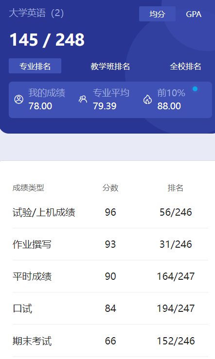

# 概述

​	老师是 liu wei。非常好的老师😍大学的英语和高中很不一样，大学一星期只有一节英语课，如果只从应试的角度课上能学到的知识不多，其他的课程也差不多。记得四六级前老师还会给我们模拟卷子让我们练习，不过不少人都是胡写的，老师好像也没说过什么🤣

​	我们那时还是分快慢班，在开学没多久会有英语分班考试，这个只会影响英语课，和别的没啥关系。当时我高考英语133，英语分班考试之后分到了慢班，还难受了一小会，后来感觉慢班是真舒服啊🤣不过从23级分成了3个等级班，好像还会影响考四六级的时间，这个我也不太清楚。

# 上机

​	每隔几周要到机房上课做听力，有个U校园听力课程，把它搞到满分就行了。至于怎么做，懂得都懂😋

# 作业

​	老师当时还要我们记笔记，让我们从China Daily上学习英语，有时候还会检查我们的笔记，现在想想老师是真负责啊。

# 平时成绩

​	出勤率吧，不太清楚。

# 口试

​	她当时要求我们可以单人、双人，也可以多人展示。我是和一个朋友搞了个对话，没啥压力。

# 期末

​	英语这个课只要你不是跟老师对着干，我觉得根本不可能挂科，除非你实在是摆到极致了。大部分老师到最后都是会海底捞，毕竟对绝大多数人来说，高三就是英语最巅峰的时刻了，甚至是智力最巅峰的时刻🤣

​	大一下的英语和大一上也没多大差别。大一下我四级过了😋

# 时间线

创建时间：2024.7.5

最后一次修改时间：2024.12.17
