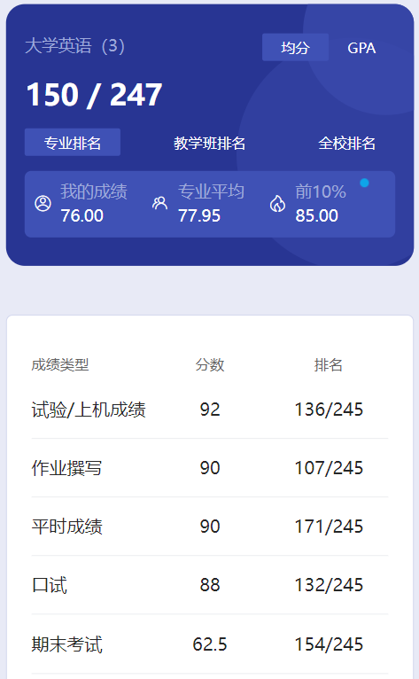
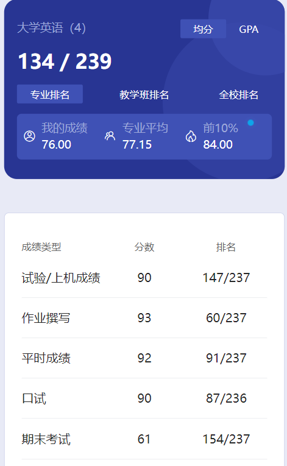

# 概述

​	老师是 chen lu lin。理论上来说英语老师是不会变的，我们 liu 老师好像有事，就换了个老师。

# 上机

​	和大一一样。

# 作业

​	做过两次PPT。

# 平时成绩

​	人少的时候老师会点名。

# 口试

​	老师给了个短文，一分钟之内背完就过了，很轻松。

# 期末

​	和大一英语没什么区别。

​	六级擦边一次过，这辈子都不用再学英语了，哈哈哈哈😋

# 时间线

创建时间：2024.7.1

最后一次修改时间：2024.12.17
