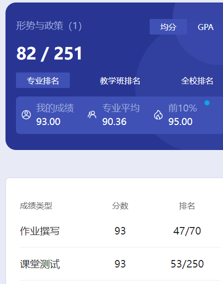

# 概述

​	这个课每学期都有，到大四也有。大一大二是线下，每学期4节课。大三大四是学习通考试。

# 作业

​	学习通作业。

# 测试

​	学习通测试。

# 总结

​	这我就只放一次成绩了。这个课只要作业按时写就没啥问题，千万不要被老师抓到逃课之类的事，或者说作业忘了写什么的。马院的课逃了被抓什么后果我就不明说了，懂得都懂😡正常上课就没啥问题。

# 时间线

创建时间：2024.7.5

最后一次修改时间：2024.12.17
